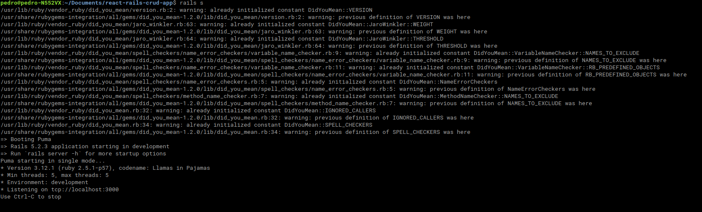
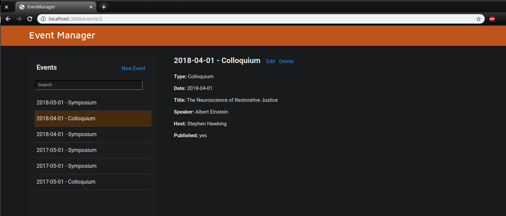

# Creating a Simple CRUD App with Rails and React

This is the code repository to accompany a [tutorial](https://hibbard.eu/rails-react-crud-app/) on how to create a Rails API then, using a Webpacker gemfile, build a React front-end to consume it.

## Requirements

- [Ruby](https://www.ruby-lang.org/en/downloads/)
- [Node.js](http://nodejs.org/)

There are instructions for installing both Ruby and Node at the beginning of the tutorial.

### Important Note
This repository uses [Ruby](https://www.ruby-lang.org/en/downloads/) v2.5.1 and [Node.js](http://nodejs.org/) v8.10.0

## Installation

- Clone repo
- Run `bundle install`
- Run `yarn install`
- Run `rake db:create`, `rake db:migrate`, then `rake db:seed`

## Running

- Start the Rails server with `rails s`
- In a second terminal start the bepback-dev-server with `./bin/server`
- Hit http://localhost:3000/events/

## Image Results

- Starting the rails server:

- Showing events presents .JSON file in an Event Manager webpage:

